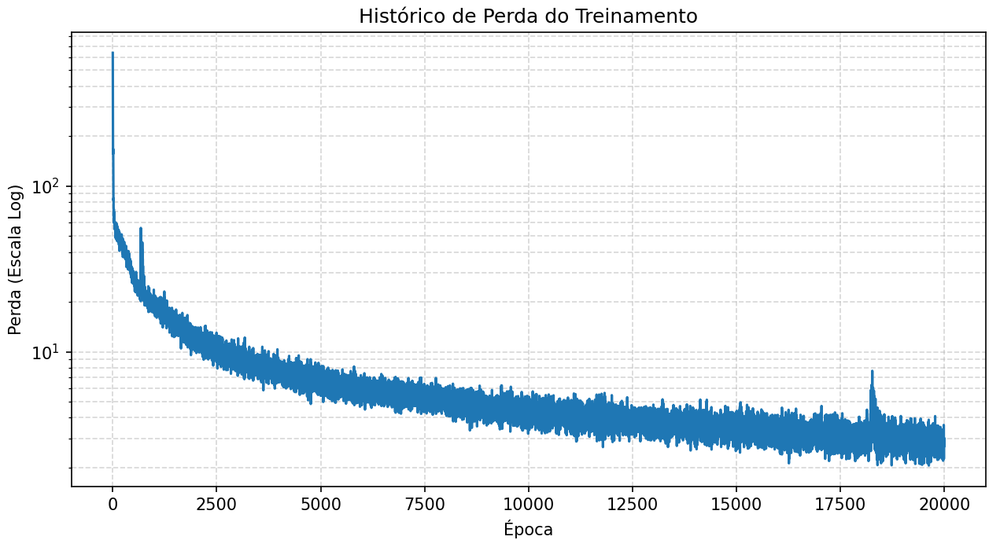
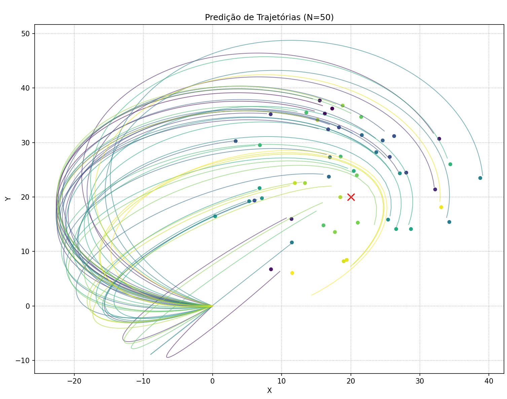
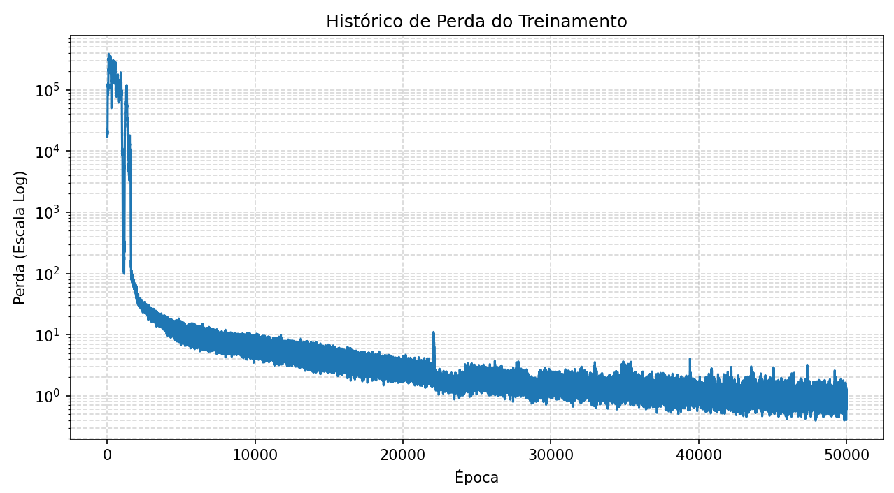
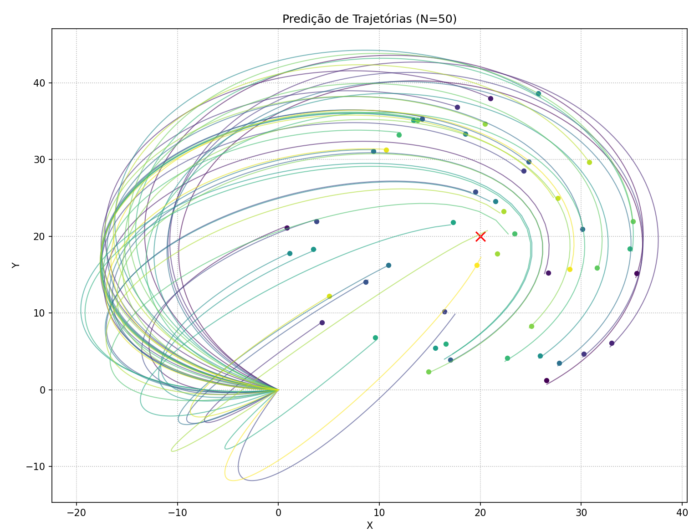

# TrajectoryPredictor

Projeto que visa criar predições de trajetórias de um objeto em um determinado ambiente bidimensional. Esse projeto foi feito para o curso de Machine Learning para Equações Diferenciais do PICME.

## Instalação

Para instalar e começar a usar o projeto:
- Instale o **Git** e o **Python** (de preferência, Python na versão 3.12).
- Use no terminal o comando `git clone https://github.com/VitinDenoyr/TrajectoryPredictor.git .`
- Use no terminal o comando `pip install -e .`

## Uso

Execute o **main.py** para um terminal interativo de opções que você pode usar.

1.  **Configuração**: Instanciar o `TrajectoryPredictor` com um dicionário de hiperparâmetros.
2.  **Treino**: Utilizar a classe `Trainer` para treinar os pesos da rede.
3.  **Visualização**: Usar o `Visualizer` para analisar gráficos de perda e trajetórias.
4.  **Simulação**: Disparar o `Simulator` para testar a rede em tempo real com PyGame.

## Estrutura de Pastas

O projeto segue uma estrutura modular e orientada a objetos.

```
trajectory_predictor/
├── main.py                     # Ponto de entrada
├── pyproject.toml              # Configuração de pacote e dependências oficiais
├── configs/
│   └── default.py              # Dicionários de hiperparâmetros padrão (Default, Dummy)
├── runs/                       # Instâncias salvas (.pth e .json)
├── res/                        # Recursos visuais
└── src/
    ├── core/                   # Arquivos centrais do projeto
    │   ├── predictor.py        # Classe de estado e salvamento
    │   ├── trainer.py          # Responsável pelo treinamento
    │   └── losses.py           # Funções de perda
    ├── models/
    │   └── architectures.py    # Definição das Redes Neurais
    └── utils/                  # Ferramentas auxiliares
        ├── physics.py          # Integradores numéricos e física
        ├── visualizer.py       # Visualização de gráficos
        ├── simulator.py        # Simulador interativo
        └── helpers.py          # Funções auxiliares
```

<br/><br/>

# Previsão de Trajetória com Corpo Gravitacional usando Redes Neurais

Esse projeto tem o objetivo de criar um modelo de redes neurais capaz de, dado um cenário bidimensional com:
- Um corpo gravitacional em uma posição ($\alpha,\beta$) (m,m) e massa $M$ (kg);
- Uma posição objetivo ($x,y$) (m,m) no espaço;

Queremos prever valores de:
- Velocidade ($v$) (m/s);
- Direção ($\theta$) (rad);
- Tempo ($t$) (s);

De modo que ao lançar um projétil:
- Partindo da posição ($0,0$);
- Com um ângulo $\theta$;
- Com velocidade inicial $v$;

O projétil alcançará a posição ($x,y$) no tempo $t$, mesmo sob influência da gravidade do corpo gravitacional.

<br/><br/>

# Componentes Principais

As principais componentes do projeto são:

## Arquiteturas (src/models/)
* **SingleAim**: Uma rede neural MLP que recebe o alvo e utiliza funções de ativação escalonadas para garantir saídas dentro de limites físicos.

## Funções de Perda e Física (src/core/losses.py & src/utils/physics.py)
Implementação de **PINNs (Physics-Informed Neural Networks)**:
* **Euler Semi-Implícito**: Método de primeira ordem, rápido para iterações iniciais.
* **Runge-Kutta 4 (RK4)**: Método de quarta ordem, alta precisão para cenários orbitais complexos.

## O Treinador (src/core/trainer.py)
* **Geração de Dados**: Alvos são gerados dinamicamente ao redor de planetas dados como habitáveis a cada época de treino.
* **Estabilidade**: Gerencia instabilidades numéricas, aplicando Gradient Clipping e recuperando o melhor estado caso a perda venha a divergir.

## Simulação Interativa (src/utils/simulator.py)
Ambiente interativo desenvolvido em Pygame que permite:
* **Controle Manual**: Controle de mira e força via mouse.
* **Trajetória da IA**: Pressione espaço para visualizar e usar a trajetória calculada pela rede neural em tempo real.

<br/><br/>

# Resultados

O desempenho do modelo é medido pela distância euclidiana final entre o projétil e o alvo. Assume-se uma unidade arbitrária de distância (uA) para o cenário. Para referência, o corpo gravitacional está a uma distância de aproximadamente **28.3 uA** do ponto inicial. O melhor modelo obtido durante o processo de treinamento principal foi tomado como `defaultModel`, sendo o baseline atual para a criação de variações. Há duas instâncias dele salvas, uma com 20.000 épocas e outra com 50.000 épocas. Os resultados obtidos foram os seguintes:

## defaultModel-20k

### Curva de Loss:



</br>

### Amostra das métricas da avaliação:

|Métrica|Valor|
|---|---|
|MSE|2.135469|
|MAE|1.040921|
|Erro Mínimo|0.033360|
|Erro Máximo|5.304142|
|Mediana dos Erros|0.833194|

</br>

### Amostra de gráficos de trajetórias:



</br></br>

## defaultModel-50k

### Curva de Loss:



</br>

### Amostra das métricas da avaliação:

|Métrica|Valor|
|---|---|
|MSE|0.460853|
|MAE|0.453087|
|Erro Mínimo|0.028482|
|Erro Máximo|3.181155|
|Mediana dos Erros|0.302380|

</br>

### Amostra de gráficos de trajetórias:


